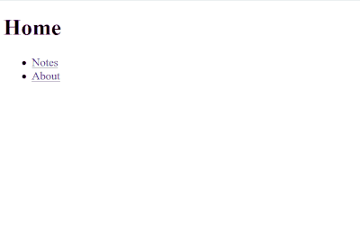

# Vue Routing Animation Demo

Demo to animate something when you move pages using [Vue.js](https://vuejs.org/).



Live demo:

- [https://ginpei.github.io/vue-routing-animation-demo/](https://ginpei.github.io/vue-routing-animation-demo/)

Inspired by a demo of ReactTransitionGroup:

- [Animated page transitions with React Router 4, ReactTransitionGroup and Animated](https://hackernoon.com/animated-page-transitions-with-react-router-4-reacttransitiongroup-and-animated-1ca17bd97a1a)

# Animating

Animation itself is implemented in short CSS in [`routing-animation.css`](https://github.com/ginpei/vue-routing-animation-demo/blob/868d6139d5c2635452c6a4f19b5cf2bdd8ac3efb/routing-animation.css):

```css
[routing-animation] {
    visibility: hidden;
}

[routing-animation].is-preparedRoutingAnimation {
    animation: routingAnimation-show 300ms;
    visibility: visible;
}

@keyframes routingAnimation-show {
    0%   { opacity: 0; transform: translateY(1rem); }
    100% { opacity: 1; transform: translateY(0); }
}
```

The elements which have the attribute `routing-animation` are the target.

The class `is-preparedRoutingAnimation` is driven by [`BaseLayout.vue`](https://github.com/ginpei/vue-routing-animation-demo/blob/868d6139d5c2635452c6a4f19b5cf2bdd8ac3efb/src/components/layouts/BaseLayout.vue#L21-L26) which is a wrapper component for all pages. It adds the class when routing so that they animate.

```javascript
mounted() {
    const els = Array.from(this.$el.querySelectorAll('[routing-animation]'));
    els.forEach((el, index)=>{
        setTimeout(()=>el.classList.add('is-preparedRoutingAnimation'), 50 * index);
    });
},
```

Here is an example of usage of `BaseLayout` and `routing-animation` from [`Home.vue`](https://github.com/ginpei/vue-routing-animation-demo/blob/868d6139d5c2635452c6a4f19b5cf2bdd8ac3efb/src/components/views/misc/Home.vue):

```html
<template>
    <base-layout>
        <h1 routing-animation>Home</h1>
        <ul>
            <li routing-animation><router-link to="/notes/">Notes</router-link></li>
            <li routing-animation><router-link to="/about">About</router-link></li>
        </ul>
    </base-layout>
</template>
```
